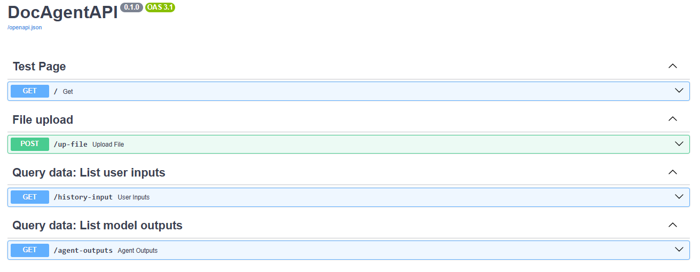

# DocAgent API

Este Agente terá como principal objetivo responder perguntas sobre algum projeto específico, neste caso o agente terá acesso ao repositório onde o projeto esta versionado.

> Ferramentas: 

- `Python 3.12.*`
- `Fastapi 0.115.6`
- `Websockets 14.2`
- `google-generativeai ^0.8.3`


> Como usar o `DocAgent API`:

> Gere as credenciais Azure e clone o repositório:

```bash
git clone https://desenv2rp@dev.azure.com/desenv2rp/Document%20Image%20Processing/_git/DocAgent
```

> Crie um arquivo `.env` seguindo o exemplo `.env.sample`:

> Execute o  `Docker container`:

```bash
docker-compose up -d
```

> Acesse a documentação da API:

